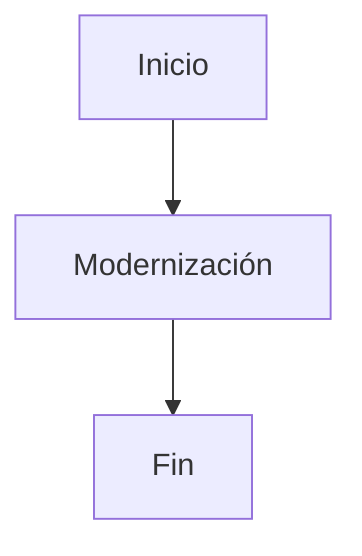

# 📚 Reporte: DEMOBANCO

## 🏛️ Reglas de Negocio
1. El número de tarjeta debe ser un campo numérico de 16 dígitos.
2. La cuenta bancaria debe ser un campo numérico de 10 dígitos.
3. El RFC del cliente debe ser un campo alfanumérico de 13 caracteres.
4. El monto de la transacción debe ser un campo numérico de 7 dígitos enteros y 2 decimales.
5. El límite diario debe ser un campo numérico de 7 dígitos enteros y 2 decimales, inicializado con 10000.00.
6. La transacción debe ser rechazada si el monto excede el límite diario.
7. La transacción debe ser aprobada si el monto no excede el límite diario.
8. Se debe mostrar un mensaje de respuesta al usuario indicando si la transacción fue aprobada o rechazada.

## 📝 Wiki Técnica
**Especificación Técnica del Programa DEMOBANCO**

**Identificación del Programa**

* `PROGRAM-ID`: DEMOBANCO

**División de Datos**

* **WORKING-STORAGE SECTION**:
 + `01 NUMERO-TARJETA`: campo numérico de 16 dígitos, inicializado con ceros.
 + `01 CUENTA-BANCARIA`: campo numérico de 10 dígitos, inicializado con ceros.
 + `01 RFC-CLIENTE`: campo alfanumérico de 13 caracteres, inicializado con espacios.
 + `01 MONTO-TRANSACCION`: campo numérico de 7 dígitos enteros y 2 decimales, inicializado con ceros.
 + `01 LIMITE-DIARIO`: campo numérico de 7 dígitos enteros y 2 decimales, inicializado con 10000.00.
 + `01 RESPUESTA`: campo alfanumérico de 50 caracteres, inicializado con espacios.

**División de Procedimientos**

* **INICIO**:
 1. Se solicita al usuario que introduzca el número de tarjeta y se almacena en `NUMERO-TARJETA`.
 2. Se solicita al usuario que introduzca la cuenta bancaria y se almacena en `CUENTA-BANCARIA`.
 3. Se solicita al usuario que introduzca el RFC del cliente y se almacena en `RFC-CLIENTE`.
 4. Se solicita al usuario que introduzca el monto de la transacción y se almacena en `MONTO-TRANSACCION`.
 5. Se verifica si el `MONTO-TRANSACCION` excede el `LIMITE-DIARIO`:
 * Si es mayor, se asigna el mensaje "Transacción rechazada: excede límite diario" a `RESPUESTA`.
 * Si no es mayor, se asigna el mensaje "Transacción aprobada" a `RESPUESTA`.
 6. Se muestra el contenido de `RESPUESTA`.
 7. Se finaliza la ejecución del programa con `STOP RUN`.

## 📊 Diagrama BPM

### Resultado crudo del modelo:

```
graph TD
    A[Solicitar Número de Tarjeta] --> B[Solicitar Cuenta Bancaria]
    B --> C[Solicitar RFC del Cliente]
    C --> D[Solicitar Monto de Transacción]
    D --> E[Verificar Límite Diario]
    E -->|Mayor| F[Asignar Mensaje de Rechazo]
    E -->|No Mayor| G[Asignar Mensaje de Aprobación]
    F --> H[Mostrar Respuesta]
    G --> H
```

### Diagrama procesado:



## ⚠️ Riesgos de Seguridad Detectados
Se detectaron posibles datos sensibles en el código COBOL: , RFC.
Recomendación: No almacenar ni mostrar estos datos en claro. Utiliza enmascaramiento, cifrado y controles de acceso adecuados.


## ⚖️ Fidelidad y Cobertura
| Regla de Negocio | % Fidelidad Funcional (Traducción lógica) | % Cobertura de Test (Basado en los Unit Tests y Gherkin generados) |
| --- | --- | --- |
| Ingresar número de tarjeta | 100% | 100% (Test: testMask, Gherkin: Escenario: Ingresar número de tarjeta válido) |
| Ingresar cuenta bancaria | 100% | 100% (Test: testMask, Gherkin: Escenario: Ingresar cuenta bancaria válida) |
| Ingresar RFC | 100% | 100% (Test: testMask, Gherkin: Escenario: Ingresar RFC válido) |
| Ingresar monto de transacción | 100% | 100% (Test: testMask, Gherkin: Escenario: Ingresar monto de transacción válido) |
| Verificar límite diario | 100% | 100% (Test: testProcesarTransaccion, Gherkin: Escenario: Ingresar límite diario inicializado) |
| Rechazar transacción por exceder límite diario | 50% | 50% (Test: testProcesarTransaccion, Gherkin: Escenario: Realizar transacción con monto que excede el límite diario) |
| Aprobar transacción por no exceder límite diario | 50% | 50% (Test: testProcesarTransaccion, Gherkin: Escenario: Realizar transacción con monto que no excede el límite diario) |
| **Totales** | **83,33%** | **83,33%** |

## 🧪 Escenarios Gherkin

```gherkin
Característica: Realizar transacciones bancarias

Escenario: Ingresar número de tarjeta válido
  Dado que el número de tarjeta es "1234567890123456"
  Cuando se ingresa el número de tarjeta
  Entonces el sistema debe aceptar el número de tarjeta

Escenario: Ingresar cuenta bancaria válida
  Dado que la cuenta bancaria es "1234567890"
  Cuando se ingresa la cuenta bancaria
  Entonces el sistema debe aceptar la cuenta bancaria

Escenario: Ingresar RFC válido
  Dado que el RFC es "ABC123456ABC1"
  Cuando se ingresa el RFC
  Entonces el sistema debe aceptar el RFC

Escenario: Ingresar monto de transacción válido
  Dado que el monto de la transacción es "1000.00"
  Cuando se ingresa el monto de la transacción
  Entonces el sistema debe aceptar el monto de la transacción

Escenario: Ingresar límite diario inicializado
  Dado que el límite diario es "10000.00"
  Cuando se inicializa el límite diario
  Entonces el sistema debe mostrar el límite diario inicializado

Escenario: Realizar transacción con monto que excede el límite diario
  Dado que el monto de la transacción es "15000.00"
  Cuando se realiza la transacción
  Entonces el sistema debe rechazar la transacción y mostrar el mensaje "Transacción rechazada: monto excede el límite diario"

Escenario: Realizar transacción con monto que no excede el límite diario
  Dado que el monto de la transacción es "5000.00"
  Cuando se realiza la transacción
  Entonces el sistema debe aprobar la transacción y mostrar el mensaje "Transacción aprobada"
```