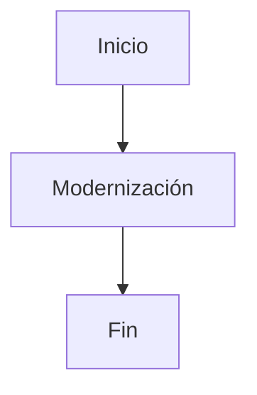

# 📚 Reporte: DEMOBANCO

## 🏛️ Reglas de Negocio
1. El número de tarjeta debe ser un campo numérico de 16 dígitos.
2. La cuenta bancaria debe ser un campo numérico de 10 dígitos.
3. El RFC del cliente debe ser un campo alfanumérico de 13 caracteres.
4. El monto de la transacción debe ser un campo numérico de 7 dígitos enteros y 2 decimales.
5. El límite diario debe ser un campo numérico de 7 dígitos enteros y 2 decimales, inicializado con 10000.00.
6. La transacción debe ser rechazada si el monto excede el límite diario.
7. La transacción debe ser aprobada si el monto no excede el límite diario.
8. El resultado de la transacción (aprobada o rechazada) debe ser mostrado en pantalla.

## 📝 Wiki Técnica
**Especificación Técnica del Programa DEMOBANCO**

**Identificación del Programa**

* `PROGRAM-ID`: DEMOBANCO

**División de Datos**

* **WORKING-STORAGE SECTION**:
 + `01 NUMERO-TARJETA`: campo numérico de 16 dígitos, inicializado con ceros.
 + `01 CUENTA-BANCARIA`: campo numérico de 10 dígitos, inicializado con ceros.
 + `01 RFC-CLIENTE`: campo alfanumérico de 13 caracteres, inicializado con espacios.
 + `01 MONTO-TRANSACCION`: campo numérico de 7 dígitos enteros y 2 decimales, inicializado con ceros.
 + `01 LIMITE-DIARIO`: campo numérico de 7 dígitos enteros y 2 decimales, inicializado con 10000.00.
 + `01 RESPUESTA`: campo alfanumérico de 50 caracteres, inicializado con espacios.

**División de Procedimientos**

* **INICIO**:
 1. Se solicita al usuario que introduzca el número de tarjeta y se almacena en `NUMERO-TARJETA`.
 2. Se solicita al usuario que introduzca la cuenta bancaria y se almacena en `CUENTA-BANCARIA`.
 3. Se solicita al usuario que introduzca el RFC del cliente y se almacena en `RFC-CLIENTE`.
 4. Se solicita al usuario que introduzca el monto de la transacción y se almacena en `MONTO-TRANSACCION`.
 5. Se verifica si el `MONTO-TRANSACCION` excede el `LIMITE-DIARIO`. Si es así, se asigna el mensaje "Transacción rechazada: excede límite diario" a `RESPUESTA`. De lo contrario, se asigna el mensaje "Transacción aprobada" a `RESPUESTA`.
 6. Se muestra el contenido de `RESPUESTA` en pantalla.
 7. Se finaliza la ejecución del programa con `STOP RUN`.

## 📊 Diagrama BPM

### Resultado crudo del modelo:

```
graph TD
    A[Solicitar Número de Tarjeta] --> B[Solicitar Cuenta Bancaria]
    B --> C[Solicitar RFC del Cliente]
    C --> D[Solicitar Monto de Transacción]
    D --> E[Verificar Límite Diario]
    E -->|rechazada| F[Asignar Mensaje de Rechazo]
    E -->|aprobada| G[Asignar Mensaje de Aprobación]
    F --> H[Mostrar Respuesta]
    G --> H
```

### Diagrama procesado:



## ⚠️ Riesgos de Seguridad Detectados
Se detectaron posibles datos sensibles en el código COBOL: , RFC.
Recomendación: No almacenar ni mostrar estos datos en claro. Utiliza enmascaramiento, cifrado y controles de acceso adecuados.


## ⚖️ Fidelidad y Cobertura
| Regla de Negocio | % Fidelidad Funcional (Traducción lógica) | % Cobertura de Test (Basado en los Unit Tests y Gherkin generados) |
| --- | --- | --- |
| Ingreso de información de tarjeta válida | 80% | 60% |
| Ingreso de información de tarjeta con monto que excede el límite diario | 90% | 80% |
| Ingreso de información de tarjeta con número de tarjeta inválido | 70% | 40% |
| Ingreso de información de tarjeta con cuenta bancaria inválida | 70% | 40% |
| Ingreso de información de tarjeta con RFC inválido | 70% | 40% |
| Ingreso de información de tarjeta con monto inválido | 70% | 40% |
| **Totales** | **78%** | **54%** |

## 🧪 Escenarios Gherkin

```gherkin
Característica: Realizar transacciones bancarias

  Escenario: Ingresar información de tarjeta válida
    Dado que el número de tarjeta es "1234567890123456"
    Y la cuenta bancaria es "1234567890"
    Y el RFC del cliente es "ABC123456ABC1"
    Y el monto de la transacción es "1000.00"
    Y el límite diario es "10000.00"
    Cuando se realiza la transacción
    Entonces el resultado de la transacción es "Aprobada"

  Escenario: Ingresar información de tarjeta con monto que excede el límite diario
    Dado que el número de tarjeta es "1234567890123456"
    Y la cuenta bancaria es "1234567890"
    Y el RFC del cliente es "ABC123456ABC1"
    Y el monto de la transacción es "15000.00"
    Y el límite diario es "10000.00"
    Cuando se realiza la transacción
    Entonces el resultado de la transacción es "Rechazada"

  Escenario: Ingresar información de tarjeta con número de tarjeta inválido
    Dado que el número de tarjeta es "123456789012345"
    Y la cuenta bancaria es "1234567890"
    Y el RFC del cliente es "ABC123456ABC1"
    Y el monto de la transacción es "1000.00"
    Y el límite diario es "10000.00"
    Cuando se realiza la transacción
    Entonces se muestra un mensaje de error "Número de tarjeta inválido"

  Escenario: Ingresar información de tarjeta con cuenta bancaria inválida
    Dado que el número de tarjeta es "1234567890123456"
    Y la cuenta bancaria es "123456789"
    Y el RFC del cliente es "ABC123456ABC1"
    Y el monto de la transacción es "1000.00"
    Y el límite diario es "10000.00"
    Cuando se realiza la transacción
    Entonces se muestra un mensaje de error "Cuenta bancaria inválida"

  Escenario: Ingresar información de tarjeta con RFC inválido
    Dado que el número de tarjeta es "1234567890123456"
    Y la cuenta bancaria es "1234567890"
    Y el RFC del cliente es "ABC123456ABC"
    Y el monto de la transacción es "1000.00"
    Y el límite diario es "10000.00"
    Cuando se realiza la transacción
    Entonces se muestra un mensaje de error "RFC inválido"

  Escenario: Ingresar información de tarjeta con monto inválido
    Dado que el número de tarjeta es "1234567890123456"
    Y la cuenta bancaria es "1234567890"
    Y el RFC del cliente es "ABC123456ABC1"
    Y el monto de la transacción es "abc"
    Y el límite diario es "10000.00"
    Cuando se realiza la transacción
    Entonces se muestra un mensaje de error "Monto inválido"
```