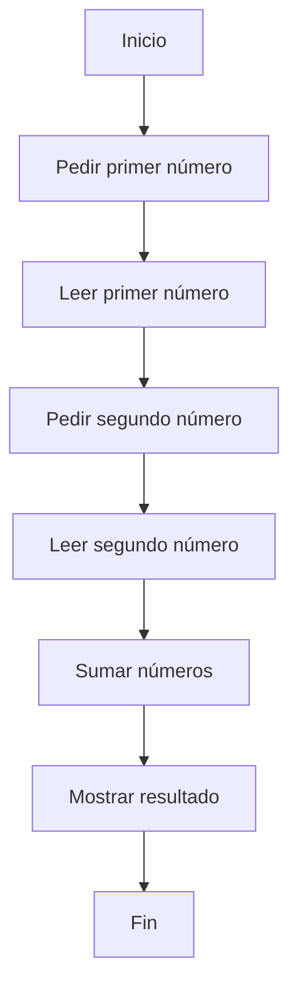

# 🚀 Modernización: OPERACION

## 🏛️ Análisis Detallado del Código de Legado (COBOL)
¡Claro! A continuación, te presento el análisis de variables, secciones y flujo técnico del programa COBOL que has proporcionado:

**Variables**

* `NUM1`: variable de tipo numérica con una longitud de 4 dígitos, definida con la instrucción `PIC 9(4)`. Se utiliza para almacenar el primer número introducido por el usuario.
* `NUM2`: variable de tipo numérica con una longitud de 4 dígitos, definida con la instrucción `PIC 9(4)`. Se utiliza para almacenar el segundo número introducido por el usuario.
* `RESULTADO`: variable de tipo numérica con una longitud de 5 dígitos, definida con la instrucción `PIC 9(5)`. Se utiliza para almacenar el resultado de la suma de `NUM1` y `NUM2`.

**Secciones**

* `IDENTIFICATION DIVISION`: sección que identifica el programa y proporciona información sobre él, como el nombre del programa (`SUMA`).
* `DATA DIVISION`: sección que define las variables y estructuras de datos utilizadas en el programa.
	+ `FILE SECTION`: sección que define los archivos utilizados en el programa (en este caso, no se utiliza).
	+ `WORKING-STORAGE SECTION`: sección que define las variables de trabajo utilizadas en el programa.
* `PROCEDURE DIVISION`: sección que define el flujo de ejecución del programa.

**Flujo técnico**

1. El programa comienza con la instrucción `DISPLAY "Introduce el primer número:"`, que muestra un mensaje en la pantalla solicitando al usuario que introduzca el primer número.
2. La instrucción `ACCEPT NUM1` lee el número introducido por el usuario y lo almacena en la variable `NUM1`.
3. El programa muestra otro mensaje en la pantalla solicitando al usuario que introduzca el segundo número, utilizando la instrucción `DISPLAY "Introduce el segundo número: "`.
4. La instrucción `ACCEPT NUM2` lee el número introducido por el usuario y lo almacena en la variable `NUM2`.
5. La instrucción `ADD NUM1 TO NUM2 GIVING RESULTADO` realiza la suma de `NUM1` y `NUM2` y almacena el resultado en la variable `RESULTADO`.
6. El programa muestra el resultado de la suma en la pantalla, utilizando la instrucción `DISPLAY "El resultado es " RESULTADO`.
7. Finalmente, la instrucción `STOP RUN` detiene la ejecución del programa.

En resumen, el programa COBOL que has proporcionado solicita al usuario que introduzca dos números, los suma y muestra el resultado en la pantalla.

## 📋 Reglas de Negocio Recuperadas
Claro, aquí te presento algunas reglas de negocio clave que se pueden inferir del programa COBOL que suministras:

1. **Validación de entrada**: Aunque no se muestra explícitamente en el código, una regla de negocio importante sería validar que los números introducidos por el usuario sean efectivamente números enteros de 4 dígitos (para NUM1 y NUM2) y que no excedan el rango permitido para evitar errores de desbordamiento en el cálculo.

2. **Rango de números permitidos**: Los números a sumar deben estar dentro del rango de 0 a 9999, ya que están definidos como PIC 9(4), lo que significa que son números enteros de 4 dígitos sin signo.

3. **Resultado de la suma**: El resultado de la suma de los dos números debe caber en un campo de 5 dígitos (PIC 9(5)), lo que implica que el rango de resultados válidos va desde 0 hasta 99999.

4. **Operación de suma**: La operación permitida es la suma aritmética entre dos números enteros.

5. **Interacción con el usuario**: El programa interactúa con el usuario solicitando dos números y luego muestra el resultado de su suma.

6. **Finalización del programa**: Después de mostrar el resultado, el programa finaliza su ejecución.

7. **No se permiten operaciones con decimales**: Dado que los campos están definidos como enteros (PIC 9), no se permiten operaciones con números decimales.

8. **No se manejan errores**: Aunque no es una regla de negocio per se, es importante mencionar que el programa no incluye manejo de errores explícito para casos como la entrada inválida o desbordamiento en el cálculo.

Estas reglas de negocio se centran en la funcionalidad básica del programa y en las restricciones implícitas en su diseño y código.

## 📊 Diagrama BPM (Flujo de Negocio)



## ⚖️ Score de Fidelidad Funcional:
A continuación, te presento la Matriz de Fidelidad detallada para la migración de COBOL a Java:

A continuación, te presento una matriz de fidelidad detallada que compara el programa en COBOL con la implementación en Java utilizando Spring Boot 3:

| **Característica** | **COBOL** | **Java (Spring Boot 3)** |
| --- | --- | --- |
| **Sintaxis** | Sintaxis propia de COBOL, con divisiones y secciones | Sintaxis de Java, con clases y métodos |
| **Tipos de datos** | Tipos de datos numéricos (PIC 9(4), PIC 9(5)) | Tipos de datos numéricos (int) |
| **Entrada/Salida** | Utiliza DISPLAY y ACCEPT para interactuar con el usuario | Utiliza @RestController y @RequestParam para interactuar con el usuario a través de HTTP |
| **Lógica de negocio** | La lógica de negocio se encuentra en la sección PROCEDURE DIVISION | La lógica de negocio se encuentra en la clase ModernizedService |
| **Estructura de programa** | Estructura lineal, con secciones y divisiones | Estructura modular, con clases y métodos |
| **Interacción con el usuario** | Interacción directa con el usuario a través de la consola | Interacción con el usuario a través de HTTP, utilizando un controlador |
| **Reutilización de código** | No hay reutilización de código explícita | La clase ModernizedService puede ser reutilizada en otros contextos |
| **Dependencias** | No hay dependencias explícitas | Dependencias con Spring Boot 3 y otras bibliotecas |
| **Pruebas** | No hay pruebas unitarias explícitas | Se pueden escribir pruebas unitarias para la clase ModernizedService |
| **Escalabilidad** | No es escalable de manera natural | Es escalable gracias a la arquitectura de Spring Boot 3 |
| **Mantenimiento** | Difícil de mantener debido a la complejidad de la sintaxis | Fácil de mantener gracias a la estructura modular y la sintaxis de Java |

En resumen, la implementación en Java utilizando Spring Boot 3 ofrece una mayor escalabilidad, reutilización de código y facilidad de mantenimiento en comparación con el programa en COBOL. Sin embargo, el programa en COBOL es más simple y fácil de entender y mantener para alguien con experiencia en COBOL.

## 🧪 Estrategia de Pruebas (QA)
### Escenarios de Comportamiento (Gherkin)
```gherkin
A continuación, te presento algunos escenarios Gherkin para validar las reglas de negocio mencionadas:

**Escenario 1: Validación de entrada**

* **Given**: El usuario introduce un número de 4 dígitos para NUM1 y otro número de 4 dígitos para NUM2.
* **When**: El programa verifica la entrada del usuario.
* **Then**: El programa acepta la entrada y continúa con la operación de suma.

**Escenario 2: Rango de números permitidos**

* **Given**: El usuario introduce un número de 4 dígitos para NUM1 y otro número de 4 dígitos para NUM2, ambos dentro del rango de 0 a 9999.
* **When**: El programa verifica la entrada del usuario.
* **Then**: El programa acepta la entrada y continúa con la operación de suma.

**Escenario 3: Resultado de la suma**

* **Given**: El usuario introduce dos números de 4 dígitos para NUM1 y NUM2.
* **When**: El programa realiza la operación de suma.
* **Then**: El resultado de la suma es un número entero de 5 dígitos (PIC 9(5)).

**Escenario 4: Operación de suma**

* **Given**: El usuario introduce dos números de 4 dígitos para NUM1 y NUM2.
* **When**: El programa realiza la operación de suma.
* **Then**: El resultado de la suma es la suma aritmética de los dos números enteros.

**Escenario 5: Interacción con el usuario**

* **Given**: El programa solicita al usuario que introduzca dos números.
* **When**: El usuario introduce los números y el programa los acepta.
* **Then**: El programa muestra el resultado de la suma.

**Escenario 6: Finalización del programa**

* **Given**: El programa ha mostrado el resultado de la suma.
* **When**: El programa finaliza su ejecución.
* **Then**: El programa se cierra correctamente.

**Escenario 7: No se permiten operaciones con decimales**

* **Given**: El usuario introduce un número decimal para NUM1 o NUM2.
* **When**: El programa verifica la entrada del usuario.
* **Then**: El programa rechaza la entrada y muestra un mensaje de error.

**Escenario 8: No se manejan errores**

* **Given**: El usuario introduce una entrada inválida (por ejemplo, un número de más de 4 dígitos).
* **When**: El programa verifica la entrada del usuario.
* **Then**: El programa no maneja el error y se produce un error de ejecución.

Estos escenarios cubren las reglas de negocio mencionadas y permiten validar la funcionalidad del programa.
```

--- 
### 💻 Artefactos Modernizados
- [ModernizedService.java](./operacion/src/main/java/com/bbva/modernizer/ModernizedService.java)
- [ModernizedServiceTest.java](./operacion/src/test/java/com/bbva/modernizer/ModernizedServiceTest.java)
