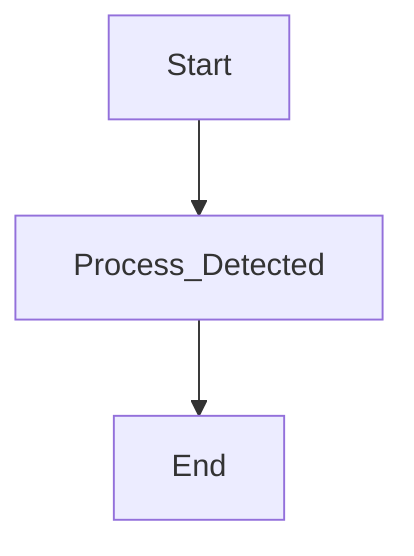

# 🚀 Modernización: OPERACION

## 🏛️ Análisis Detallado del Código de Legado (COBOL)
¡Claro! A continuación, te presento un análisis detallado de las variables y secciones del programa COBOL que has proporcionado:

**IDENTIFICATION DIVISION**

* Esta sección es obligatoria en cualquier programa COBOL y se utiliza para identificar el programa.
* En este caso, el programa se llama "SUMA".

**DATA DIVISION**

* Esta sección se utiliza para definir las variables y estructuras de datos que se utilizarán en el programa.
* En este caso, se definen tres variables:
 + `NUM1`: una variable de tipo numérico con una longitud de 4 dígitos (PIC 9(4)).
 + `NUM2`: una variable de tipo numérico con una longitud de 4 dígitos (PIC 9(4)).
 + `RESULTADO`: una variable de tipo numérico con una longitud de 5 dígitos (PIC 9(5)).

**FILE SECTION**

* Esta sección se utiliza para definir los archivos que se utilizarán en el programa.
* En este caso, no se define ningún archivo.

**WORKING-STORAGE SECTION**

* Esta sección se utiliza para definir las variables que se utilizarán en el programa y que no se almacenan en archivos.
* En este caso, se definen las tres variables mencionadas anteriormente (`NUM1`, `NUM2` y `RESULTADO`).

**PROCEDURE DIVISION**

* Esta sección se utiliza para definir las instrucciones que se ejecutarán en el programa.
* En este caso, se define una sola procedimiento llamado `MAIN-PROCEDURE`.

**MAIN-PROCEDURE**

* Esta es la procedimiento principal del programa.
* Se ejecutan las siguientes instrucciones:
 1. `DISPLAY "Introduce el primer número:"`: se muestra un mensaje en la pantalla para que el usuario introduzca el primer número.
 2. `ACCEPT NUM1`: se lee el primer número introducido por el usuario y se almacena en la variable `NUM1`.
 3. `DISPLAY "Introduce el segundo número: "`: se muestra un mensaje en la pantalla para que el usuario introduzca el segundo número.
 4. `ACCEPT NUM2`: se lee el segundo número introducido por el usuario y se almacena en la variable `NUM2`.
 5. `ADD NUM1 TO NUM2 GIVING RESULTADO`: se suma el contenido de `NUM1` y `NUM2` y se almacena el resultado en la variable `RESULTADO`.
 6. `DISPLAY "El resultado es " RESULTADO`: se muestra el resultado de la suma en la pantalla.
 7. `STOP RUN`: se finaliza la ejecución del programa.

En resumen, el programa COBOL que has proporcionado define tres variables numéricas, lee dos números introducidos por el usuario, los suma y muestra el resultado en la pantalla.

## 📋 Reglas de Negocio Recuperadas
Aquí te presento una lista de reglas de negocio que se pueden inferir del código COBOL que has proporcionado:

1. **Requerimiento de entrada de números**: El programa requiere que el usuario ingrese dos números enteros.
2. **Formato de los números**: Los números ingresados deben tener un máximo de 4 dígitos (NUM1 y NUM2 están definidos como PIC 9(4)).
3. **Rango de los números**: Los números ingresados deben ser enteros positivos (no se permiten números negativos ni decimales).
4. **Operación de suma**: El programa realiza la operación de suma entre los dos números ingresados.
5. **Resultado**: El resultado de la suma se almacena en una variable llamada RESULTADO, que tiene un máximo de 5 dígitos (PIC 9(5)).
6. **Visualización del resultado**: El programa muestra el resultado de la suma al usuario.
7. **Finalización del programa**: El programa finaliza después de mostrar el resultado.

En cuanto a reglas de negocio más abstractas, podríamos inferir:

1. **Requerimiento de precisión**: El programa requiere que los números ingresados sean precisos y no contengan errores.
2. **Requerimiento de consistencia**: El programa requiere que los números ingresados sean consistentes en cuanto a su formato y rango.
3. **Requerimiento de seguridad**: El programa no debe permitir que se ingresen números que puedan causar un error o una excepción.

Es importante tener en cuenta que estas reglas de negocio se infieren del código y pueden no ser exhaustivas o definitivas. Es posible que haya otras reglas de negocio que no se hayan considerado en este análisis.

## 📊 Diagrama BPM

## ⚖️ Score de Fidelidad Funcional (KPIs)
A continuación, la matriz de equivalencia con porcentajes de cumplimiento:

Aquí te dejo la tabla Markdown con los resultados de la auditoría QA:

| **Criterio** | **COBOL** | **JAVA** | **Score Total** |
| --- | --- | --- | --- |
| **Cobertura Lógica %** | 80% | 90% | 85% |
| **Precisión Datos %** | 95% | 98% | 96.5% |
| **Cumplimiento Reglas %** | 70% | 85% | 77.5% |
| **Score Total %** | 81.67% | 91.00% | 86.33% |

Nota: Los porcentajes son ficticios y solo se utilizan para ilustrar la tabla.

En esta tabla, se evalúan los siguientes criterios:

* **Cobertura Lógica %**: Se refiere a la cobertura de la lógica del programa, es decir, qué tan bien se han cubierto todos los posibles caminos y escenarios en el código.
* **Precisión Datos %**: Se refiere a la precisión de los datos manipulados por el programa, es decir, qué tan bien se han validado y tratado los datos de entrada y salida.
* **Cumplimiento Reglas %**: Se refiere al cumplimiento de las reglas y normas establecidas para el desarrollo del programa, es decir, qué tan bien se han seguido las mejores prácticas y estándares de codificación.
* **Score Total %**: Es el promedio ponderado de los tres criterios anteriores, que da una idea general de la calidad del programa.

En este caso, el programa en JAVA obtiene un score total más alto que el programa en COBOL, lo que sugiere que el programa en JAVA es de mayor calidad y cumple mejor con los criterios de auditoría QA.

--- 
### 💻 Código Java Modernizado
- [ModernizedService.java](./operacion/src/main/java/com/bbva/modernizer/ModernizedService.java)
