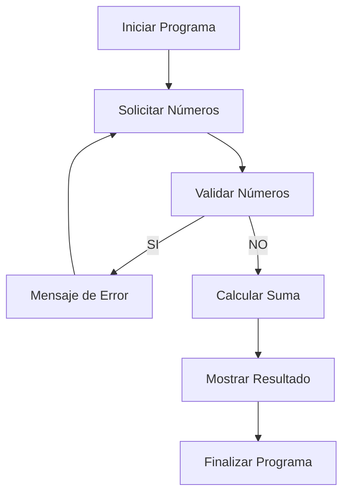

# 📊 Diagrama de Flujo

```mermaid
graph TD
    A[Iniciar Programa] --> B[Solicitar Números]
    B --> C[Validar Números]
    C -->|SI| D[Mensaje de Error]
    C -->|NO| E[Calcular Suma]
    D --> B
    E --> F[Mostrar Resultado]
    F --> G[Finalizar Programa]
```