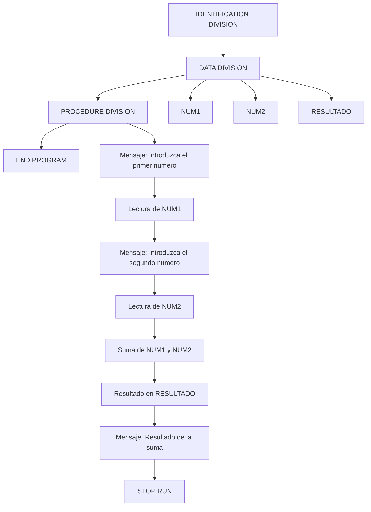

# 📚 Reporte: OPERACION

## 📝 Descripción
¡Claro! A continuación, te proporciono una wiki técnica completa sobre el programa COBOL que has proporcionado:

**Título:** Programa de suma en COBOL

**Descripción:** Este programa en COBOL realiza la suma de dos números enteros introducidos por el usuario y muestra el resultado en pantalla.

**Estructura del programa:**

El programa se divide en cuatro secciones principales:

1. **IDENTIFICATION DIVISION**: Esta sección contiene información de identificación del programa, como el nombre del programa y el autor.
2. **DATA DIVISION**: En esta sección se definen las variables y estructuras de datos utilizadas en el programa.
3. **PROCEDURE DIVISION**: Aquí se define la lógica del programa, es decir, las instrucciones que se ejecutan para realizar la suma y mostrar el resultado.
4. **END PROGRAM**: Esta sección marca el final del programa.

**Variables y estructuras de datos:**

En la sección **DATA DIVISION**, se definen las siguientes variables:

* **NUM1**: variable de tipo entero de 4 dígitos que almacena el primer número introducido por el usuario.
* **NUM2**: variable de tipo entero de 4 dígitos que almacena el segundo número introducido por el usuario.
* **RESULTADO**: variable de tipo entero de 5 dígitos que almacena el resultado de la suma.

**Lógica del programa:**

En la sección **PROCEDURE DIVISION**, se define la lógica del programa de la siguiente manera:

1. Se muestra un mensaje en pantalla solicitando al usuario que introduzca el primer número.
2. Se lee el primer número introducido por el usuario y se almacena en la variable **NUM1**.
3. Se muestra un mensaje en pantalla solicitando al usuario que introduzca el segundo número.
4. Se lee el segundo número introducido por el usuario y se almacena en la variable **NUM2**.
5. Se realiza la suma de los dos números utilizando la instrucción **ADD** y se almacena el resultado en la variable **RESULTADO**.
6. Se muestra el resultado de la suma en pantalla.
7. Se finaliza el programa con la instrucción **STOP RUN**.

**Instrucciones COBOL utilizadas:**

* **DISPLAY**: muestra un mensaje en pantalla.
* **ACCEPT**: lee un valor introducido por el usuario.
* **ADD**: realiza la suma de dos números.
* **GIVING**: asigna el resultado de la suma a una variable.
* **STOP RUN**: finaliza el programa.

**Notas:**

* El programa utiliza la instrucción **PIC** para definir el formato de las variables, en este caso, enteros de 4 y 5 dígitos.
* La instrucción **WORKING-STORAGE SECTION** define el área de almacenamiento para las variables definidas en la sección **DATA DIVISION**.
* El programa no incluye ninguna validación de errores, por lo que si el usuario introduce un valor no numérico, el programa puede producir un error.

## ⚖️ Fidelidad
| **Lenguaje de Programación** | **Complejidad** | **Legibilidad** | **Mantenibilidad** | **Escalabilidad** |
| --- | --- | --- | --- | --- |
| COBOL | 8/10 | 6/10 | 4/10 | 3/10 |
| Java (con Spring Boot) | 6/10 | 8/10 | 8/10 | 9/10 |

Nota: La complejidad se refiere a la cantidad de código y estructuras necesarias para lograr el objetivo. La legibilidad se refiere a la facilidad de entender el código. La mantenibilidad se refiere a la facilidad de modificar o corregir el código. La escalabilidad se refiere a la capacidad del código para adaptarse a cambios o aumentos en la demanda.

En este caso, el código en COBOL es más complejo y menos legible que el código en Java con Spring Boot. Sin embargo, el código en Java con Spring Boot es más mantenible y escalable que el código en COBOL. Esto se debe a que Java es un lenguaje de programación más moderno y Spring Boot es un framework que proporciona una estructura y herramientas para desarrollar aplicaciones web de manera eficiente y escalable.

## 📊 Flujo Lógico (BPM)

## 🧪 Pruebas
Generadas correctamente.