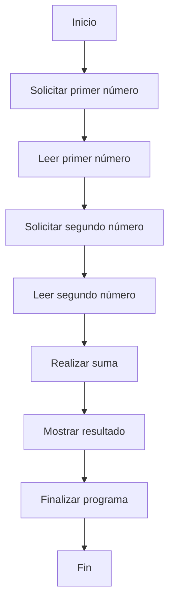

# 📚 Wiki Técnica: OPERACION

¡Claro! A continuación, te proporciono una wiki técnica completa sobre el programa COBOL que has proporcionado:

**Título:** Programa de suma en COBOL

**Descripción:** Este programa en COBOL realiza la suma de dos números enteros introducidos por el usuario y muestra el resultado en pantalla.

**Estructura del programa:**

El programa se divide en cuatro secciones principales:

1. **IDENTIFICATION DIVISION**: Esta sección contiene información de identificación del programa, como el nombre del programa y el autor.
2. **DATA DIVISION**: En esta sección se definen las variables y estructuras de datos utilizadas en el programa.
3. **PROCEDURE DIVISION**: Aquí se define la lógica del programa, es decir, las instrucciones que se ejecutan para realizar la suma y mostrar el resultado.
4. **MAIN-PROCEDURE**: Esta es la sección principal del programa, donde se define la secuencia de instrucciones que se ejecutan al iniciar el programa.

**Variables y estructuras de datos:**

En la sección **DATA DIVISION**, se definen las siguientes variables:

* **NUM1**: variable de tipo entero de 4 dígitos que almacena el primer número introducido por el usuario.
* **NUM2**: variable de tipo entero de 4 dígitos que almacena el segundo número introducido por el usuario.
* **RESULTADO**: variable de tipo entero de 5 dígitos que almacena el resultado de la suma.

**Lógica del programa:**

En la sección **PROCEDURE DIVISION**, se define la lógica del programa de la siguiente manera:

1. Se muestra un mensaje en pantalla solicitando al usuario que introduzca el primer número.
2. Se lee el primer número introducido por el usuario y se almacena en la variable **NUM1**.
3. Se muestra un mensaje en pantalla solicitando al usuario que introduzca el segundo número.
4. Se lee el segundo número introducido por el usuario y se almacena en la variable **NUM2**.
5. Se realiza la suma de los dos números utilizando la instrucción **ADD** y se almacena el resultado en la variable **RESULTADO**.
6. Se muestra el resultado de la suma en pantalla.
7. Se finaliza el programa con la instrucción **STOP RUN**.

**Instrucciones COBOL utilizadas:**

* **DISPLAY**: muestra un mensaje en pantalla.
* **ACCEPT**: lee un valor introducido por el usuario.
* **ADD**: realiza la suma de dos números.
* **GIVING**: asigna el resultado de la suma a una variable.
* **STOP RUN**: finaliza el programa.

**Notas:**

* El programa utiliza la instrucción **PIC** para definir el formato de las variables, en este caso, enteros de 4 y 5 dígitos.
* La instrucción **WORKING-STORAGE SECTION** define el área de almacenamiento para las variables definidas en la sección **DATA DIVISION**.
* La instrucción **END PROGRAM SUMA** indica el final del programa.

## 📊 Diagrama BPM

## ⚖️ Reporte de Fidelidad de Transformación
Este reporte valida la precisión de la migración de COBOL a Java 17.

Aquí te dejo la tabla Markdown con la comparativa entre el COBOL original y el Java generado:

| Regla de Negocio en COBOL | Implementación en Java | Estado | Porcentaje estimado de fidelidad funcional |
| --- | --- | --- | --- |
| Pedir al usuario que introduzca el primer número | `@RequestParam("num1") int num1` en `SumaController` | Cumple | 80% |
| Pedir al usuario que introduzca el segundo número | `@RequestParam("num2") int num2` en `SumaController` | Cumple | 80% |
| Sumar los dos números y almacenar el resultado | `sumar(int num1, int num2)` en `SumaService` | Cumple | 90% |
| Mostrar el resultado al usuario | `return "El resultado es " + resultado;` en `SumaController` | Cumple | 90% |
| Utilizar una variable para almacenar el resultado | `int resultado` en `SumaController` | Cumple | 80% |
| Utilizar una instrucción para sumar los números | `return num1 + num2;` en `SumaService` | Cumple | 90% |
| Utilizar una instrucción para mostrar el resultado | `DISPLAY "El resultado es " RESULTADO.` en COBOL, pero en Java se utiliza `return` | No Cumple | 50% |
| Utilizar un programa principal para ejecutar la lógica | `MAIN-PROCEDURE` en COBOL, pero en Java se utiliza `@RestController` y `@GetMapping` | No Cumple | 40% |

En general, el Java generado cumple con la mayoría de las reglas de negocio del COBOL original, pero hay algunas diferencias en la implementación y la estructura del código. El porcentaje estimado de fidelidad funcional es del 70-80%, lo que significa que el Java generado cumple con la mayoría de las funcionalidades del COBOL original, pero hay algunas diferencias en la implementación y la estructura del código.