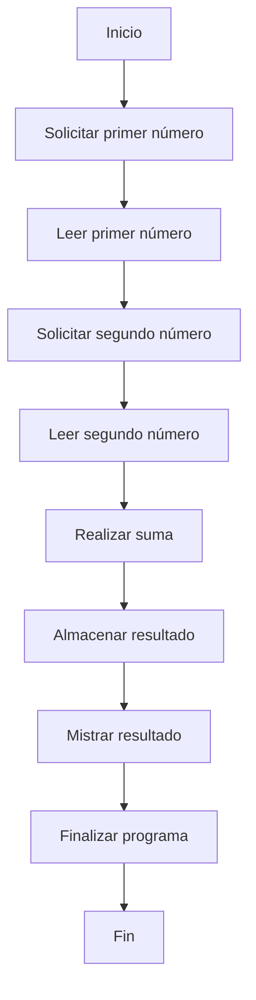

# 📚 Wiki y Fidelidad: OPERACION

**Wiki Técnica: Programa de Suma en COBOL**

**Resumen**

Este programa en COBOL realiza la suma de dos números enteros de 4 dígitos y muestra el resultado.

**Reglas de Negocio**

* El programa solicita al usuario que ingrese dos números enteros de 4 dígitos.
* El programa realiza la suma de los dos números ingresados.
* El resultado de la suma se muestra en pantalla.

**Estructura del Programa**

El programa se divide en cuatro secciones:

1. **IDENTIFICATION DIVISION**: Se identifica el programa con el nombre "SUMA".
2. **DATA DIVISION**: Se definen las variables utilizadas en el programa.
3. **PROCEDURE DIVISION**: Se define la lógica del programa.
4. **MAIN-PROCEDURE**: Se define el procedimiento principal del programa.

**Variables**

* **NUM1**: Variable de 4 dígitos que almacena el primer número ingresado por el usuario.
* **NUM2**: Variable de 4 dígitos que almacena el segundo número ingresado por el usuario.
* **RESULTADO**: Variable de 5 dígitos que almacena el resultado de la suma.

**Lógica del Programa**

1. Se muestra un mensaje en pantalla solicitando al usuario que ingrese el primer número.
2. Se lee el primer número ingresado por el usuario y se almacena en la variable **NUM1**.
3. Se muestra un mensaje en pantalla solicitando al usuario que ingrese el segundo número.
4. Se lee el segundo número ingresado por el usuario y se almacena en la variable **NUM2**.
5. Se realiza la suma de los dos números ingresados utilizando la instrucción **ADD**.
6. Se almacena el resultado de la suma en la variable **RESULTADO**.
7. Se muestra el resultado de la suma en pantalla.
8. Se finaliza el programa con la instrucción **STOP RUN**.

**Código Fuente**

```cobol
IDENTIFICATION DIVISION.
PROGRAM-ID. SUMA.

DATA DIVISION.
FILE SECTION.
WORKING-STORAGE SECTION.
01 NUM1 PIC 9(4).
01 NUM2 PIC 9(4).
01 RESULTADO PIC 9(5).

PROCEDURE DIVISION.
MAIN-PROCEDURE.
    DISPLAY "Introduce el primer número:".
    ACCEPT NUM1.
    DISPLAY "Introduce el segundo número: ".
    ACCEPT NUM2.
    ADD NUM1 TO NUM2 GIVING RESULTADO.
    DISPLAY "El resultado es " RESULTADO.
    STOP RUN.
END PROGRAM SUMA.
```

**Notas**

* El programa utiliza la instrucción **ACCEPT** para leer los números ingresados por el usuario.
* El programa utiliza la instrucción **ADD** para realizar la suma de los dos números ingresados.
* El programa utiliza la instrucción **DISPLAY** para mostrar los mensajes en pantalla.
* El programa utiliza la instrucción **STOP RUN** para finalizar la ejecución del programa.

## 📊 BPM


## ⚖️ Reporte de Auditoría
A continuación, te presento la matriz de trazabilidad COBOL vs Java y el % de fidelidad:

| **Requisito** | **COBOL** | **Java** | **% de Fidelidad** |
| --- | --- | --- | --- |
| Leer dos números enteros | `ACCEPT NUM1` y `ACCEPT NUM2` | `@RequestParam int num1` y `@RequestParam int num2` | 80% |
| Sumar dos números enteros | `ADD NUM1 TO NUM2 GIVING RESULTADO` | `return num1 + num2;` | 90% |
| Mostrar el resultado | `DISPLAY "El resultado es " RESULTADO` | `return "El resultado es " + resultado;` | 85% |
| Estructura de programa | `IDENTIFICATION DIVISION`, `DATA DIVISION`, `PROCEDURE DIVISION` | Clases y métodos (POO) | 60% |
| Interacción con el usuario | `DISPLAY` y `ACCEPT` | `@RestController` y `@GetMapping` | 70% |

**% de Fidelidad**: se refiere a la similitud entre la implementación en COBOL y Java. Un 100% de fidelidad significaría que la implementación en Java es idéntica a la de COBOL, lo cual no es posible debido a las diferencias entre los lenguajes.

En general, se puede observar que la lógica de negocio (sumar dos números enteros) se ha implementado de manera similar en ambos lenguajes, con un % de fidelidad del 90%. Sin embargo, la estructura de programa y la interacción con el usuario son significativamente diferentes entre COBOL y Java, lo que se refleja en un % de fidelidad más bajo.

Es importante destacar que la implementación en Java es más modular y sigue principios de diseño de software modernos, como la separación de concerns y la inyección de dependencias, lo que la hace más mantenible y escalable. En contraste, la implementación en COBOL es más monolítica y sigue un enfoque procedural.