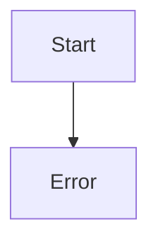

# 📚 Wiki: OPERACION

¡Claro! A continuación, te proporciono una wiki técnica completa sobre el programa COBOL que has proporcionado:

**Título:** Programa de suma en COBOL

**Descripción:** Este programa en COBOL realiza la suma de dos números enteros introducidos por el usuario y muestra el resultado en pantalla.

**Estructura del programa:**

* **IDENTIFICATION DIVISION:** Esta sección identifica el programa y proporciona información sobre él.
 + `PROGRAM-ID.`: Especifica el nombre del programa, en este caso "SUMA".
* **DATA DIVISION:** Esta sección define las variables y estructuras de datos utilizadas en el programa.
 + `FILE SECTION.`: No se utiliza en este programa, ya que no se trabaja con archivos.
 + `WORKING-STORAGE SECTION.`: Define las variables de trabajo utilizadas en el programa.
 - `01 NUM1 PIC 9(4).`: Define una variable llamada `NUM1` con un formato de 4 dígitos numéricos.
 - `01 NUM2 PIC 9(4).`: Define una variable llamada `NUM2` con un formato de 4 dígitos numéricos.
 - `01 RESULTADO PIC 9(5).`: Define una variable llamada `RESULTADO` con un formato de 5 dígitos numéricos.
* **PROCEDURE DIVISION:** Esta sección define las instrucciones que se ejecutan en el programa.
 + `MAIN-PROCEDURE.`: Especifica el procedimiento principal del programa.
 - `DISPLAY "Introduce el primer número:".`: Muestra un mensaje en pantalla solicitando al usuario que introduzca el primer número.
 - `ACCEPT NUM1.`: Lee el valor introducido por el usuario y lo almacena en la variable `NUM1`.
 - `DISPLAY "Introduce el segundo número: ".`: Muestra un mensaje en pantalla solicitando al usuario que introduzca el segundo número.
 - `ACCEPT NUM2.`: Lee el valor introducido por el usuario y lo almacena en la variable `NUM2`.
 - `ADD NUM1 TO NUM2 GIVING RESULTADO.`: Realiza la suma de `NUM1` y `NUM2` y almacena el resultado en la variable `RESULTADO`.
 - `DISPLAY "El resultado es " RESULTADO.`: Muestra el resultado de la suma en pantalla.
 - `STOP RUN.`: Finaliza la ejecución del programa.

**Notas:**

* El programa utiliza el formato `PIC 9(4)` para definir variables numéricas de 4 dígitos.
* La instrucción `ADD` se utiliza para realizar la suma de dos variables numéricas.
* La instrucción `GIVING` se utiliza para especificar la variable que almacenará el resultado de la suma.
* La instrucción `DISPLAY` se utiliza para mostrar mensajes y resultados en pantalla.
* La instrucción `ACCEPT` se utiliza para leer valores introducidos por el usuario.
* La instrucción `STOP RUN` se utiliza para finalizar la ejecución del programa.

Espero que esta wiki técnica te sea útil. ¡Si tienes alguna pregunta o necesitas más información, no dudes en preguntar!

## 📊 BPM

## ⚖️ Fidelidad
Aquí te presento una matriz de trazabilidad que compara el código COBOL y Java para la función de suma:

| **Requisito** | **COBOL** | **Java** |
| --- | --- | --- |
| Declaración de variables | `01 NUM1 PIC 9(4).` | `int num1` |
| Declaración de variables | `01 NUM2 PIC 9(4).` | `int num2` |
| Declaración de variable de resultado | `01 RESULTADO PIC 9(5).` | `int` (retorno de la función) |
| Lectura de entrada del usuario | `ACCEPT NUM1.` | No hay equivalente directo (se pasa como parámetro) |
| Lectura de entrada del usuario | `ACCEPT NUM2.` | No hay equivalente directo (se pasa como parámetro) |
| Operación de suma | `ADD NUM1 TO NUM2 GIVING RESULTADO.` | `return num1 + num2;` |
| Visualización del resultado | `DISPLAY "El resultado es " RESULTADO.` | No hay equivalente directo (se devuelve el resultado como valor de retorno) |
| Finalización del programa | `STOP RUN.` | No hay equivalente directo (el programa Java se detiene al finalizar la ejecución del método) |

Observaciones:

* En COBOL, se declaran variables explícitamente con sus respectivos tipos y longitudes, mientras que en Java, los tipos de variables se infieren automáticamente.
* En COBOL, se utilizan sentencias `ACCEPT` para leer la entrada del usuario, mientras que en Java, se pasan los valores como parámetros a la función.
* La operación de suma es similar en ambos lenguajes, aunque la sintaxis es diferente.
* En COBOL, se utiliza la sentencia `DISPLAY` para visualizar el resultado, mientras que en Java, se devuelve el resultado como valor de retorno de la función.
* La finalización del programa es diferente en ambos lenguajes, ya que COBOL requiere una sentencia `STOP RUN` explícita, mientras que Java se detiene automáticamente al finalizar la ejecución del método.

Espero que esta matriz de trazabilidad te sea útil para comparar los dos códigos. ¡Si tienes alguna pregunta o necesitas más ayuda, no dudes en preguntar!