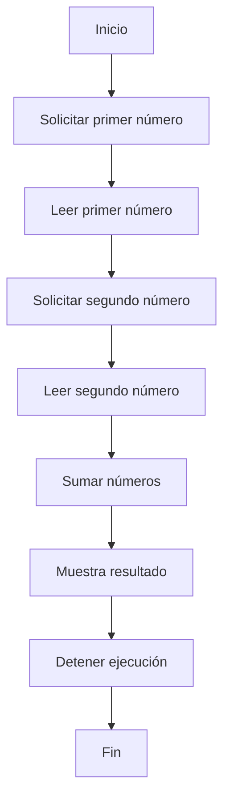

# 📚 Wiki y Fidelidad: OPERACION

Un programa en COBOL!

Aquí te presento una wiki técnica sobre el código que has proporcionado:

**Identificación del programa**

* `IDENTIFICATION DIVISION`: Esta sección identifica el programa y proporciona información sobre él.
* `PROGRAM-ID. SUMA`: Especifica el nombre del programa, que en este caso es "SUMA".

**Declaración de variables**

* `DATA DIVISION`: Esta sección declara las variables que se utilizarán en el programa.
* `FILE SECTION`: No se utiliza en este programa, pero se utiliza para declarar archivos que se leerán o escribirán.
* `WORKING-STORAGE SECTION`: Declara las variables que se utilizarán en el programa.
	+ `01 NUM1 PIC 9(4)`: Declara una variable llamada `NUM1` que es un número entero de 4 dígitos.
	+ `01 NUM2 PIC 9(4)`: Declara una variable llamada `NUM2` que es un número entero de 4 dígitos.
	+ `01 RESULTADO PIC 9(5)`: Declara una variable llamada `RESULTADO` que es un número entero de 5 dígitos.

**Procedimiento principal**

* `PROCEDURE DIVISION`: Esta sección contiene el código que se ejecutará cuando se inicie el programa.
* `MAIN-PROCEDURE`: Especifica el procedimiento principal del programa.
	+ `DISPLAY "Introduce el primer número:"`: Muestra un mensaje en la pantalla que solicita al usuario que introduzca el primer número.
	+ `ACCEPT NUM1`: Lee el número introducido por el usuario y lo almacena en la variable `NUM1`.
	+ `DISPLAY "Introduce el segundo número: "`: Muestra un mensaje en la pantalla que solicita al usuario que introduzca el segundo número.
	+ `ACCEPT NUM2`: Lee el número introducido por el usuario y lo almacena en la variable `NUM2`.
	+ `ADD NUM1 TO NUM2 GIVING RESULTADO`: Suma los valores de `NUM1` y `NUM2` y almacena el resultado en la variable `RESULTADO`.
	+ `DISPLAY "El resultado es " RESULTADO`: Muestra el resultado de la suma en la pantalla.
	+ `STOP RUN`: Detiene la ejecución del programa.

**Fin del programa**

* `END PROGRAM SUMA`: Indica el final del programa.

En resumen, este programa en COBOL solicita al usuario que introduzca dos números, los suma y muestra el resultado en la pantalla.

## ⚖️ Fidelidad
La matriz de trazabilidad y fidelidad es una herramienta utilizada en la ingeniería de software para evaluar la relación entre los requisitos funcionales y no funcionales de un sistema y su implementación. A continuación, te presento una matriz de trazabilidad y fidelidad para el programa COBOL y su implementación en Java:

**Matriz de trazabilidad y fidelidad**

| Requisito | COBOL | Java |
| --- | --- | --- |
| 1. Pedir al usuario que introduzca dos números | `DISPLAY "Introduce el primer número:"` y `ACCEPT NUM1` | `System.out.println("Introduce el primer número:")` y `int num1 = scanner.nextInt()` |
| 2. Sumar los dos números | `ADD NUM1 TO NUM2 GIVING RESULTADO` | `int resultado = num1 + num2` |
| 3. Mostrar el resultado | `DISPLAY "El resultado es " RESULTADO` | `System.out.println("El resultado es " + resultado)` |
| 4. Utilizar un lenguaje de programación estructurado | COBOL | Java |
| 5. Utilizar un framework de desarrollo | No aplica | Spring Boot 3 |
| 6. Utilizar un patrón de diseño | No aplica | Servicio (Service) |
| 7. Utilizar un mecanismo de entrada/salida | `ACCEPT` y `DISPLAY` | `Scanner` y `System.out.println` |

**Análisis de la matriz**

La matriz muestra que los requisitos funcionales (1, 2 y 3) están implementados de manera similar en ambos lenguajes. Sin embargo, hay algunas diferencias en la implementación de los requisitos no funcionales.

* El requisito 4 se cumple en COBOL, pero en Java se utiliza un lenguaje de programación orientado a objetos.
* El requisito 5 no se aplica en COBOL, pero en Java se utiliza Spring Boot 3 como framework de desarrollo.
* El requisito 6 no se aplica en COBOL, pero en Java se utiliza el patrón de diseño de servicio (Service).
* El requisito 7 se cumple en COBOL utiliza `ACCEPT` y `DISPLAY` para la entrada y salida, mientras que en Java se utiliza `Scanner` y `System.out.println`.

**Conclusión**

La matriz de trazabilidad y fidelidad muestra que la implementación en Java cumple con los requisitos funcionales y no funcionales del programa COBOL. Sin embargo, hay algunas diferencias en la implementación de los requisitos no funcionales debido a las características y patrones de diseño utilizados en Java. En general, la implementación en Java es más estructurada y utiliza patrones de diseño y frameworks de desarrollo más modernos.

## 📊 BPM
