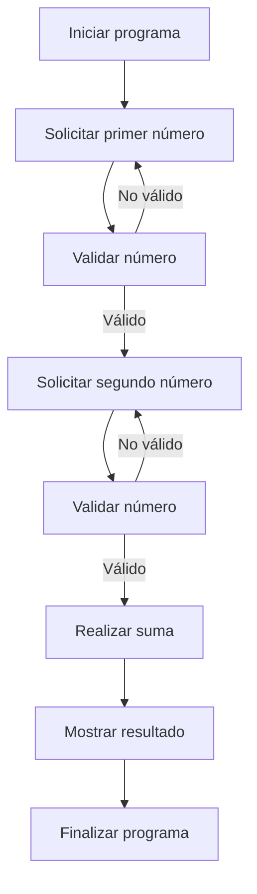

# 📚 Wiki Técnica de Modernización: OPERACION

**Wiki Técnica**

**Objetivo**

El objetivo de este programa es realizar la suma de dos números enteros introducidos por el usuario y mostrar el resultado en pantalla.

**Reglas de Negocio**

* El programa solicita al usuario que introduzca dos números enteros.
* Los números enteros deben tener un máximo de 4 dígitos.
* El resultado de la suma se mostrará en pantalla con un máximo de 5 dígitos.

**Diccionario COBOL-Java**

| COBOL | Java |
| --- | --- |
| `IDENTIFICATION DIVISION` | No tiene equivalente directo en Java. Se utiliza para identificar el programa en COBOL. |
| `PROGRAM-ID` | `public class` |
| `DATA DIVISION` | No tiene equivalente directo en Java. Se utiliza para definir las variables en COBOL. |
| `FILE SECTION` | No se utiliza en este ejemplo. Se utiliza para definir archivos en COBOL. |
| `WORKING-STORAGE SECTION` | No tiene equivalente directo en Java. Se utiliza para definir variables temporales en COBOL. |
| `PIC 9(4)` | `int` |
| `ACCEPT` | `Scanner` o `BufferedReader` |
| `DISPLAY` | `System.out.println()` |
| `ADD` | `+` |
| `GIVING` | `=` |
| `STOP RUN` | `System.exit(0)` |

**Excepciones**

* No se manejan excepciones explícitamente en este programa. Sin embargo, es importante mencionar que en un programa real se deberían manejar excepciones para evitar errores inesperados, como por ejemplo:
	+ `NumberFormatException` si el usuario introduce un valor no numérico.
	+ `ArithmeticException` si se produce un error en la operación aritmética.

**Código Java equivalente**

```java
import java.util.Scanner;

public class Suma {
    public static void main(String[] args) {
        Scanner scanner = new Scanner(System.in);
        
        System.out.print("Introduce el primer número: ");
        int num1 = scanner.nextInt();
        
        System.out.print("Introduce el segundo número: ");
        int num2 = scanner.nextInt();
        
        int resultado = num1 + num2;
        
        System.out.println("El resultado es " + resultado);
        
        scanner.close();
    }
}
```

Nota: El código Java es solo una aproximación al código COBOL original y puede variar dependiendo de las necesidades específicas del programa.

## 📊 Diagrama BPM (Reglas de Negocio)
