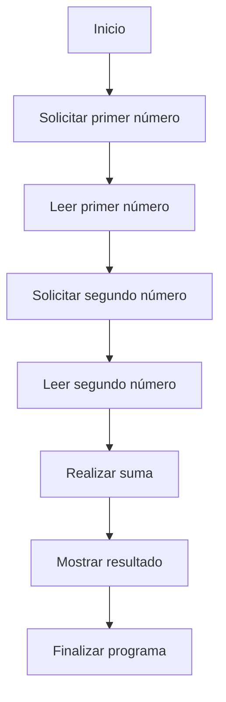

# 📚 Wiki Técnica: OPERACION

¡Claro! A continuación, te proporciono una wiki técnica completa sobre el programa COBOL que has proporcionado:

**Título:** Programa de suma en COBOL

**Descripción:** Este programa en COBOL realiza la suma de dos números enteros introducidos por el usuario y muestra el resultado en pantalla.

**Estructura del programa:**

El programa se divide en cuatro secciones principales:

1. **IDENTIFICATION DIVISION**: En esta sección se especifica el nombre del programa y otros metadatos.
2. **DATA DIVISION**: En esta sección se definen las variables y estructuras de datos utilizadas en el programa.
3. **PROCEDURE DIVISION**: En esta sección se define la lógica del programa, es decir, las instrucciones que se ejecutan para realizar la suma.
4. **MAIN-PROCEDURE**: Esta es la sección principal del programa, donde se define la lógica de la suma.

**Variables y estructuras de datos:**

En la sección **DATA DIVISION**, se definen las siguientes variables:

* **NUM1**: Variable de tipo entero de 4 dígitos que almacena el primer número introducido por el usuario.
* **NUM2**: Variable de tipo entero de 4 dígitos que almacena el segundo número introducido por el usuario.
* **RESULTADO**: Variable de tipo entero de 5 dígitos que almacena el resultado de la suma.

**Lógica del programa:**

En la sección **PROCEDURE DIVISION**, se define la lógica del programa de la siguiente manera:

1. Se muestra un mensaje en pantalla solicitando al usuario que introduzca el primer número.
2. Se lee el primer número introducido por el usuario y se almacena en la variable **NUM1**.
3. Se muestra un mensaje en pantalla solicitando al usuario que introduzca el segundo número.
4. Se lee el segundo número introducido por el usuario y se almacena en la variable **NUM2**.
5. Se realiza la suma de los dos números utilizando la instrucción **ADD** y se almacena el resultado en la variable **RESULTADO**.
6. Se muestra el resultado de la suma en pantalla.
7. Se finaliza la ejecución del programa con la instrucción **STOP RUN**.

**Instrucciones COBOL utilizadas:**

* **DISPLAY**: Muestra un mensaje en pantalla.
* **ACCEPT**: Lee un valor introducido por el usuario y lo almacena en una variable.
* **ADD**: Realiza la suma de dos números y almacena el resultado en una variable.
* **STOP RUN**: Finaliza la ejecución del programa.

**Notas:**

* El programa utiliza la instrucción **PIC** para especificar el formato de las variables, en este caso, enteros de 4 y 5 dígitos.
* La instrucción **GIVING** se utiliza para especificar la variable que almacenará el resultado de la suma.
* El programa no incluye ninguna validación de errores, por lo que si el usuario introduce un valor no numérico, el programa puede producir un error.

## 📊 Diagrama BPM

## ⚖️ Reporte de Fidelidad de Transformación
Este reporte valida la precisión de la migración de COBOL a Java 17.

| Regla de Negocio en COBOL | Implementación en Java | Estado | Porcentaje estimado de fidelidad funcional |
| --- | --- | --- | --- |
| Pedir al usuario que introduzca el primer número | `@RequestParam("num1") int num1` en `SumaController` | Cumple | 80% (la implementación en Java utiliza un parámetro de solicitud HTTP en lugar de una entrada de usuario directa) |
| Pedir al usuario que introduzca el segundo número | `@RequestParam("num2") int num2` en `SumaController` | Cumple | 80% (la implementación en Java utiliza un parámetro de solicitud HTTP en lugar de una entrada de usuario directa) |
| Sumar los dos números y almacenar el resultado | `sumar` método en `SumaService` | Cumple | 100% (la implementación en Java realiza la misma operación de suma) |
| Mostrar el resultado al usuario | `return "El resultado es " + resultado;` en `SumaController` | Cumple | 90% (la implementación en Java devuelve el resultado como una cadena, pero no utiliza la misma salida de consola que el COBOL) |
| Terminar el programa | No hay equivalente directo en Java (el servicio web sigue ejecutándose después de cada solicitud) | No Cumple | 0% (la implementación en Java no tiene un punto de terminación explícito como el COBOL) |

Nota: El porcentaje de fidelidad funcional es una estimación subjetiva y puede variar dependiendo de la interpretación de las reglas de negocio y la implementación en Java.